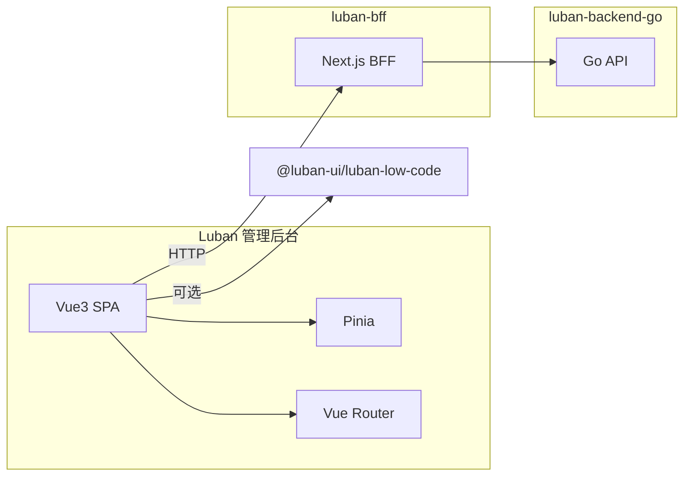

# Luban 后台管理功能设计方案

## 1. 系统定位与上下文

根据 [docs/SYSTEM_ARCHITEC.md](docs/SYSTEM_ARCHITEC.md)，Luban 是四大系统之一：

- **luban-ui**：底层组件、设计器、Render 组件
- **luban-bff**：Node 接入层，聚合 luban-backend-go 接口
- **luban-backend-go**：为 Luban 与 Render 提供数据的底层服务
- **Luban**：管理后台，负责站点配置、接入接口、页面创建与管理

Luban 与其它系统的关系如下：



当前现状：

- **luban** 为**独立仓库**（如 /Users/john/codes/luban），管理后台在此单独 repo 内实现，**不并入 luban-ui**。系统架构为既定规划，各系统边界固定。
- **luban-bff** 仍为 Next.js 默认模板，站点/页面相关 API 未实现。
- **luban-ui** 仅含底层组件与设计器（含 `apps/luban-ui` 设计器 Demo、`packages/luban-low-code` 等），不包含后台应用。

**项目落点**：Luban 管理后台在**独立仓库 luban** 中开发（Vite + Vue 3 项目）。页面编排通过 npm 安装 `@luban-ui/luban-low-code` 使用 `LubanDesigner`。

---

## 3. 技术栈

| 类别     | 选型                    | 说明                                                             |
| -------- | ----------------------- | ---------------------------------------------------------------- |
| 框架     | Vue 3                   | Composition API + `<script setup>`                               |
| 构建     | Vite                    | 独立仓库内标准 Vite 构建，无 Nx                                  |
| 路由     | Vue Router 4            | 嵌套布局 + 动态路由（站点/页面详情）                             |
| 状态     | Pinia                   | 全局状态：用户、当前站点、页面列表等                             |
| UI 库    | Element Plus            | 后台界面（表格、表单、布局、消息等）                             |
| 样式     | SASS (.scss)            | 页面与组件样式统一使用 SASS；可配合变量/混入组织主题与布局       |
| 请求     | axios 封装              | baseURL 指向 BFF；请求头 JWT（Bearer）；401 拦截跳转登录         |
| 单元测试 | Vitest + Vue Test Utils | 组件与逻辑单测，`*.spec.ts` 与源码同目录或集中于 `src/__tests__` |
| E2E 测试 | Cypress 或 Playwright   | 关键流程：登录、工作台、站点/页面/用户列表与导航等               |

说明：后台 shell（布局、导航、表格、表单）使用 Element Plus；**页面管理**中的「低代码画布」可内嵌 `LubanDesigner`（来自 `@luban-ui/luban-low-code`），与 Material Design 的 base 组件并存。

---

## 4. 路由与页面结构

### 4.1 路由设计

- **根布局**：侧栏 + 顶栏 + 主内容区（Element Plus Layout）。
- **路由模式**：`createWebHistory`（若需与 BFF 同域可再定 base）。
- **鉴权**：采用 **JWT**。Token 存 localStorage，请求头 `Authorization: Bearer <token>`；路由守卫 `beforeEach` 校验 token，无 token 或 401 时清空 token 并重定向到 `/login`。

建议路由表（示意）：

| 路径                           | 名称     | 说明                                               |
| ------------------------------ | -------- | -------------------------------------------------- |
| `/login`                       | 登录     | 独立布局，无侧栏；登录成功后写 JWT 入 localStorage |
| `/`                            | 工作台   | 默认重定向到 `/dashboard`                          |
| `/dashboard`                   | 工作台   | 概览（站点数、页面数、最近更新等）                 |
| `/sites`                       | 站点列表 | 站点管理入口                                       |
| `/sites/:id`                   | 站点详情 | 站点配置、所属页面列表入口                         |
| `/sites/:id/pages`             | 页面列表 | 某站点下的页面 CRUD 列表                           |
| `/sites/:siteId/pages/:pageId` | 页面编辑 | 内嵌 LubanDesigner 编辑 schema                     |
| `/sites/:siteId/pages/new`     | 新建页面 | 同上，创建后跳转编辑                               |
| `/users`                       | 用户管理 | 用户列表、新建/编辑/禁用等                         |
| `/settings`                    | 系统设置 | 系统级配置（如基础信息、安全、通知等）             |

首期页面：工作台、登录、站点管理、页面管理、**用户管理**、**系统设置**。

### 4.2 目录与文件组织（独立仓库 luban 根目录）

```
luban/                          # 独立 repo 根目录
├── src/
│   ├── main.ts
│   ├── App.vue
│   ├── router/
│   │   └── index.ts          # createRouter、routes、beforeEach
│   ├── stores/               # Pinia
│   │   ├── index.ts
│   │   ├── user.ts           # 用户/登录态
│   │   ├── site.ts           # 当前站点、站点列表（可选）
│   │   └── page.ts           # 当前页面 schema、列表（可选）
│   ├── views/
│   │   ├── Login.vue
│   │   ├── Dashboard.vue
│   │   ├── site/
│   │   │   ├── SiteList.vue
│   │   │   └── SiteDetail.vue
│   │   ├── page/
│   │   │   ├── PageList.vue
│   │   │   └── PageEditor.vue   # 内嵌 LubanDesigner
│   │   ├── user/
│   │   │   └── UserList.vue     # 用户管理列表与表单
│   │   └── settings/
│   │       └── Settings.vue     # 系统设置
│   ├── layouts/
│   │   ├── DefaultLayout.vue    # 侧栏 + 顶栏 + router-view
│   │   └── LoginLayout.vue      # 仅居中卡片
│   ├── api/                     # 与 BFF 对接
│   │   ├── request.ts           # axios 封装、baseURL、JWT 请求头与 401 处理
│   │   ├── auth.ts              # login、logout、refresh（若需）
│   │   ├── site.ts
│   │   ├── page.ts
│   │   ├── user.ts              # 用户 CRUD
│   │   └── settings.ts          # 系统设置读写
│   └── styles/               # SASS，页面样式统一 .scss
│       ├── index.scss        # 入口，可 @use 变量/混入
│       └── _variables.scss   # 可选：颜色、间距等变量
├── src/__tests__/            # 可选：集中放置单测
├── cypress/                   # 或 e2e/（Playwright）
│   ├── e2e/                  # E2E 用例（如 login.cy.ts）
│   └── support/
├── index.html
├── vite.config.mts
├── vitest.config.ts          # Vitest 配置
├── tsconfig.json
├── cypress.config.ts         # 或 playwright.config.ts
└── package.json
```

- 路由在 `router/index.ts` 中集中定义，布局通过 `route.meta.layout` 或父级 `<router-view>` 绑定 `DefaultLayout` / `LoginLayout`。
- **样式**：页面与组件样式统一使用 **SASS**（`.scss`），在 `styles/` 下维护全局入口与变量；组件内使用 `<style lang="scss" scoped>`。
- 站点管理 = SiteList + SiteDetail；页面管理 = PageList（按 siteId 过滤）+ PageEditor（LubanDesigner + 保存时调 BFF 存 schema）。

---

## 5. 核心功能与数据流

### 5.1 站点管理（站点配置与接入）

- **站点**：可抽象为「一个可对外提供页面的单元」，字段示例：id、name、标识(slug/code)、域名/基础 URL、状态、创建/更新时间等；具体字段与 luban-backend-go 的领域模型对齐。
- **列表**：`GET /api/sites`（或 BFF 封装后的路径），表格展示；新建/编辑用 Element Plus Dialog 或独立路由表单。
- **详情**：`/sites/:id` 展示站点基本信息 + 该站点下页面列表入口（跳转 `/sites/:id/pages`）。

### 5.2 页面管理（创建与管理页面）

- **列表**：`GET /api/sites/:siteId/pages`，表格展示（页面名称、路径、状态、更新时间等）；支持按站点筛选（若从站点详情进入则 siteId 已定）。
- **编辑/新建**：
  - 使用 `@luban-ui/luban-low-code` 的 `LubanDesigner` 编辑 `PageSchema`。
  - 保存时：将 `PageSchema`（含 `root`、可选 `formState`）通过 BFF 提交到后端，例如 `PUT /api/sites/:siteId/pages/:pageId` 或 `POST .../pages`。
  - 页面元数据（名称、path、发布状态等）可用表单（Element Plus）与 schema 一起提交或分接口维护。

数据流（概念）：

```mermaid
sequenceDiagram
  participant User
  participant PageEditor
  participant LubanDesigner
  participant Pinia
  participant BFF
  participant Backend
  User->>PageEditor: 打开页面编辑
  PageEditor->>BFF: GET page schema
  BFF->>Backend: 拉取 schema
  Backend-->>BFF-->>PageEditor: PageSchema
  PageEditor->>LubanDesigner: v-model schema
  User->>LubanDesigner: 拖拽/配置
  LubanDesigner->>PageEditor: update:schema
  User->>PageEditor: 保存
  PageEditor->>BFF: PUT schema + 元数据
  BFF->>Backend: 持久化
```

### 5.3 与 BFF / 后端的对接

- BFF（luban-bff）尚未实现站点/页面 API，建议在 Luban 中先定义 **api 层**（`api/request.ts`、`api/site.ts`、`api/page.ts`），接口方法按「期望的 REST 形状」编写，例如：
  - `getSites()`、`getSite(id)`、`createSite(data)`、`updateSite(id, data)`
  - `getPages(siteId)`、`getPage(siteId, pageId)`、`savePage(siteId, pageId, schema)`、`createPage(siteId, data)`
- **JWT 鉴权**：`request.ts` 中 `baseURL` 指向 BFF；从 localStorage 读取 JWT，请求头统一设置 `Authorization: Bearer <token>`；响应拦截器在 401 时清空 token、跳转 `/login`。登录接口返回的 token 写入 localStorage，登出时清除。
- 后端与 BFF 的站点/页面/用户/设置领域模型与接口由后端与 BFF 实现时再对齐；Luban 端保持接口方法签名稳定，仅调整 URL/字段映射即可。

### 5.4 用户管理

- **列表**：`GET /api/users`（或 BFF 封装路径），表格展示用户（账号、姓名、角色、状态、创建时间等）；支持搜索、分页。
- **新建/编辑**：Dialog 或抽屉表单，提交 `POST /api/users`、`PUT /api/users/:id`；字段与后端用户模型对齐（如账号、密码、姓名、角色、状态等）。
- **禁用/启用**：调用相应接口更新用户状态。

### 5.5 系统设置

- **单页或分组 Tab**：展示系统级配置项（如系统名称、Logo、安全策略、通知开关等），与后端 `GET/PUT /api/settings` 或按模块拆分接口对接。
- 表单使用 Element Plus 控件，保存时提交到 BFF。

---

## 6. 实现顺序建议

1. **在独立仓库 luban 中初始化 Vue 3 + Vite 项目**

- 在 luban 仓库根目录创建 Vite + Vue + TypeScript 项目（如 `pnpm create vite . --template vue-ts` 或等价方式），不放入 luban-ui。

2. **接入技术栈**

- 安装并配置：vue-router、pinia、element-plus、axios、**sass**。
- 在 `main.ts` 中 `createApp().use(router).use(pinia).use(ElementPlus).mount('#app')`；入口引入 `styles/index.scss`。
- 页面与组件样式统一使用 **SASS**（`.scss`），组件内 `<style lang="scss" scoped>`。
- 配置路由表与两种布局（登录布局、默认后台布局）。

3. **布局与导航**

- 实现 `DefaultLayout`（Element Plus Layout + 侧栏菜单对应上述路由 + 顶栏用户/登出）。
- 实现 `LoginLayout` 与占位登录页。

4. **站点管理**

- 实现站点列表、新建/编辑（表单）、详情页；api 层调用占位或 mock，待 BFF 就绪后替换。

5. **页面管理**

- 页面列表（按站点）、进入编辑页后内嵌 `LubanDesigner`，保存时调用 api 层写入 schema；同样可先 mock 或占位 BFF。

6. **鉴权（JWT）**

- 登录页：表单提交账号密码，调用 BFF 登录接口，将返回的 JWT 存入 localStorage，跳转 `/dashboard`。
- `api/request.ts`：请求拦截器从 localStorage 取 token 并设置 `Authorization: Bearer <token>`；响应拦截器对 401 清空 token 并跳转 `/login`。
- 路由守卫：`beforeEach` 中若访问非 `/login` 且无 token，则重定向到 `/login`。
- 登出：清除 localStorage 中的 token，跳转 `/login`。

7. **工作台**

- 占位页：统计卡片、快捷入口（站点、页面、用户等）。

8. **用户管理**

- 用户列表（表格、搜索、分页）、新建/编辑用户（表单）、禁用/启用；api 层 `api/user.ts` 对接 BFF 用户接口。

9. **系统设置**

- 系统设置页（单页或分组），表单读写系统配置；`api/settings.ts` 对接 BFF 设置接口。

10. **单元测试**

- 使用 **Vitest** + **@vue/test-utils**；为关键组件与 store/api 逻辑编写 `*.spec.ts`（与源码同目录或放在 `src/__tests__`）；在 `package.json` 中配置 `test` 脚本，CI 中运行。

11. **E2E 测试**

- 使用 **Cypress** 或 **Playwright**；覆盖关键流程：登录（含 JWT 写入与跳转）、工作台访问、侧栏导航至站点/页面/用户/设置列表等；可 mock BFF 或对接测试环境；在 `package.json` 中配置 e2e 脚本。

---

## 7. 与现有约束的对应

- **系统架构**：Luban 为独立仓库，不进入 luban-ui；四大系统边界按既定规划固定（见 luban-ui 仓库内 `docs/SYSTEM_ARCHITEC.md`）。
- **设计器依赖**：Luban 通过 npm 安装 `@luban-ui/luban-low-code`，使用其 `LubanDesigner`；不在 Luban 中直接依赖 sortablejs 等，设计器依赖由 low-code 包管理。
- **Element Plus**：仅用于管理后台 shell 与业务表单，与 luban-ui 内 Material Design 的 luban-base 无冲突。

---

## 8. 已定结论

- **用户管理、系统设置**：首期纳入，路由与视图见 §4.1、§4.2 与 §5.4、§5.5。
- **鉴权方式**：**JWT**。Token 存 localStorage，请求头 `Authorization: Bearer <token>`；401 时清空 token 并跳转登录；详见 §4.1 与 §6 步骤 6。
- **样式**：页面样式统一使用 **SASS**（`.scss`），组件内 `<style lang="scss" scoped>`，全局样式与变量放在 `src/styles/`。
- **测试**：**单元测试**（Vitest + Vue Test Utils）与 **E2E 测试**（Cypress 或 Playwright）均需配置并覆盖关键逻辑与流程；见 §3 技术栈与 §6 步骤 10、11。

以上设计可作为独立仓库 Luban 的开发依据；BFF 与 luban-backend-go 的 API 就绪后，在对应 `api/*.ts` 中对接真实 URL 与响应体即可。
